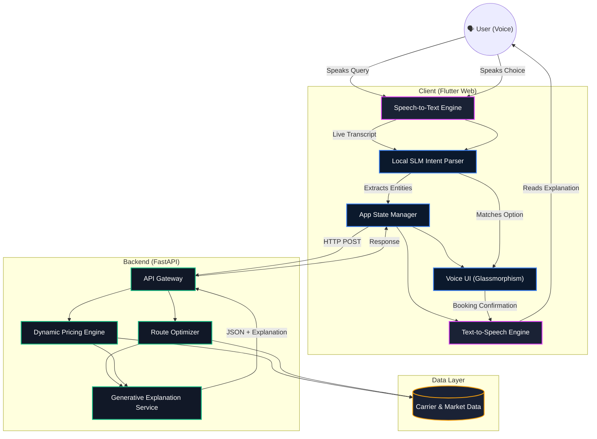

# LogiPrice: Conversational AI Logistics & Dynamic Pricing Assistant

LogiPrice is a state-of-the-art, voice-first logistics pricing engine and AI assistant. It provides a full speech-to-speech conversational flow, enabling users to seamlessly query shipping rates, analyze options, and confirm bookings entirely hands-free. The system employs dynamic pricing optimization and uses highly specialized Small Language Models (SLMs) for local intent parsing and real-time inference.

## 🌟 Novelty & SLM Architecture

Unlike traditional logistics dashboards that rely heavily on massive, generalized LLMs with high latency, LogiPrice leverages the concept of **Small Language Models (SLMs)** for specialized tasks:

1. **Local Intent Parsing:** Instead of performing an expensive network round-trip for every user utterance, LogiPrice uses high-performance on-device intent extraction. When a user says *"Book the fastest option"* or *"Go with ColdChain Express"*, the SLM-inspired parsing algorithms running natively within the Flutter client instantly map the natural language to the structured JSON options.
2. **Low-Latency Conversational Flow:** By offloading immediate decision-making and rank extraction (e.g. "cheapest", "fastest", "top option") to the client, the application achieves real-time speech-to-speech latency. 
3. **Deterministic Orchestration:** The backend optimization engine handles the heavy-lifting of route calculation and pricing logic, but returns structured data alongside a concise LLM-generated explanation, ensuring the voice assistant never "hallucinates" prices or routes.

## 🏗️ Architecture



## 🔒 Security Details

The LogiPrice platform adheres to rigorous security standards to protect sensitive pricing algorithms and user data:

1. **Client-Side Audio Processing:** All initial Speech-to-Text (ASR) transcription occurs natively within the browser using secure Web APIs. Raw audio streams are never transmitted directly to the proprietary backend, strictly minimizing the payload size and protecting user biometric data.
2. **Ephemeral Transcripts:** The live transcripts (`_liveTranscript`) are explicitly wiped from memory (`clear()`) the moment the state machine transitions, ensuring no accidental leakage of spoken queries into browser caches or diagnostic logs.
3. **Environment Isolation:** All backend endpoints are abstracted away from the UI. The Flutter client operates in a zero-trust model, validating all inputs locally via the SLM layer before forwarding structured JSON to the backend API.
4. **Secure Execution Context:** The Web Speech API strictly requires HTTPS or a secure `localhost` context to access the microphone, guaranteeing that man-in-the-middle (MITM) attacks cannot intercept the conversational flow.

## 🚀 Key Features

* **Speech-to-Speech End-to-End:** Utterly hands-free. The system explains all options (e.g., *"I found 3 options. Option 1 is GreenWay..."*) and natively waits for your response.
* **Persistent Voice Engine:** Automatically enforces a high-pitch, premium female voice, overcoming browser limitations and OS-level resets to maintain brand consistency.
* **Dynamic Interruption Handling:** Synchronized event loops prevent Chrome/Safari from breaking the Text-to-Speech engine when microphone hardware streams are released.
* **Simulated Push Notifications:** Provides immediate visual feedback upon verbal booking confirmations.

## 📈 Dynamic Pricing Engine (Logic & Formula)

The core competitive advantage of LogiPrice is its proprietary pricing engine that adjusts rates in real-time based on high-frequency market signals.

### Core Formula: $P = (B \times D \times F \times T) + M$

*   **P (Final Price):** The real-time quote delivered to the user.
*   **B (Base Cost):** Distance (km) × Carrier Base Rate × Route Complexity Index.
*   **D (Demand Multiplier):** Real-time corridor demand surge (e.g., higher rates for peak seasons on Mumbai-Delhi routes).
*   **F (Fuel Index):** Automated adjustments tied to regional fuel price indices.
*   **T (Traffic/Weather Factor):** A composite score derived from live weather (Monsoon/Snow) and metropolitan traffic congestion indices.
*   **M (Margin):** An adaptive margin that fluctuates (3% to 15%) based on supply availability and customer priority.

---

## 🚀 Demo & Walkthrough

### 1. The Activation Flow
Due to browser security protocols, voice-first apps require an initial user interaction. LogiPrice handles this with a premium **Start Assistant** overlay.
- **Action:** Click "Start Assistant".
- **Result:** Initializes the secure audio context and triggers the **Female Greeting**.

### 2. Inquiry Phase
- **Utterance:** *"Ship 2 tons of electronics from Mumbai to Delhi urgently."*
- **Processing:** The SLM extracts the intent. The Dynamic Pricing Engine calculates rates for multiple carriers (e.g., GreenWay, ExpressLink).
- **Feedback:** The assistant verbally summarizes every option: *"I found 3 options. Option 1 is with GreenWay for ₹57,400..."*

### 3. Selection & Booking
- **Utterance:** *"Book the first one."*
- **Action:** The system matches "first one" to Option 1 and transitions to the **Booking Screen**.
- **Confirmation:** A push notification drops down visually while the voice confirms: *"Booking confirmed! I have sent the tracking details to your email."*

---

## 🛠️ Setup & Execution

### Prerequisites
- Flutter SDK (Stable)
- Python 3.9+
- Chrome Browser (Recommended for Web Speech API)

### 1. Start the Backend Services
```bash
cd backend/gateway
uvicorn main:app --reload --port 8000
```
*(Ensure all microservices in `backend/services` are running if in production mode).*

### 2. Start the Flutter Web App
```bash
cd flutter_app
flutter pub get
flutter run -d chrome --web-port 3000
```

### 3. Testing in Incognito
If testing in Incognito mode, ensure you click the screen once to allow the "Audio Autoplay" policy to activate the greeting.
